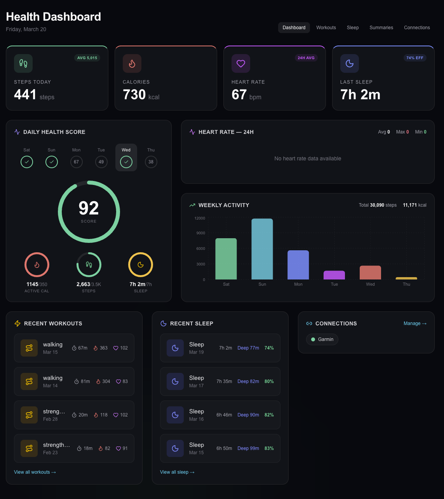

# wearables-demo

Demo app for exercising the local `@clipin/convex-wearables` Convex component.

The demo now mounts Garmin webhook and OAuth callback routes via `registerRoutes(...)` from the package, so the host app does not duplicate Garmin HTTP handler logic locally.

## Screenshots

### Health dashboard



### Connections


## Local development

Start the Next.js app:

```bash
npm run dev
```

In a separate terminal, start Convex:

```bash
npx convex dev
```

The Convex dashboard shows logs for the dev deployment, but it does not pull code changes by itself. The local `npx convex dev` process is what uploads function changes.

## Refreshing the local `convex-wearables` component

This app depends on the component via a local file dependency:

```json
"@clipin/convex-wearables": "file:../convex-wearables"
```

That means changes in `../convex-wearables` are not live-linked into this app. npm copies a snapshot of the package into `node_modules` when you install dependencies. Because of that, the demo app can drift from the current component source unless you refresh it explicitly.

Also note that the package exports used by this app point at `dist/`, not at the component source files directly, so rebuilding `../convex-wearables` is required.

When you change code in `../convex-wearables`, use this flow:

1. Rebuild the component package:

```bash
cd ../convex-wearables
npm run build
```

2. Refresh the copied package inside the demo app:

```bash
cd ../wearables-demo
npm install
```

3. Restart or rerun Convex so the updated component snapshot is uploaded and codegen is refreshed:

```bash
npx convex dev
```

If `convex dev` is already running, stop it and start it again after steps 1 and 2.

If npm still appears to use an old snapshot, delete `node_modules/@clipin/convex-wearables` and run `npm install` again.

## Sanity check

If the demo app is still calling old component code, inspect the generated component bindings:

```bash
rg "garminWebhooks|processPushPayload" convex/_generated/api.d.ts
```

If a new component module or function is missing there, the demo app has not picked up the latest local component snapshot yet.

An error like `Couldn't resolve wearables.garminWebhooks.processPushPayload` usually means this generated file is still stale.

One more constraint: the host app can only call component functions that are exposed as public `query`, `mutation`, or `action`. Component `internalQuery`, `internalMutation`, and `internalAction` functions are not callable through `components.wearables.*`.
