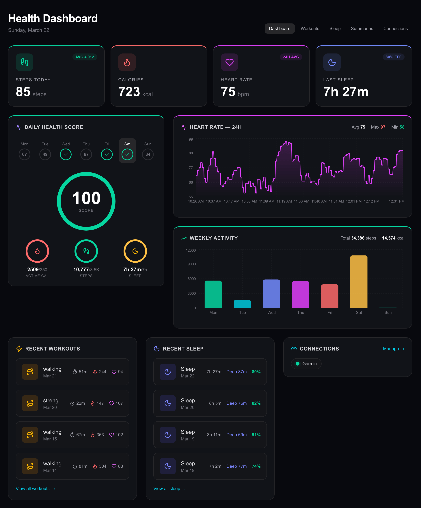
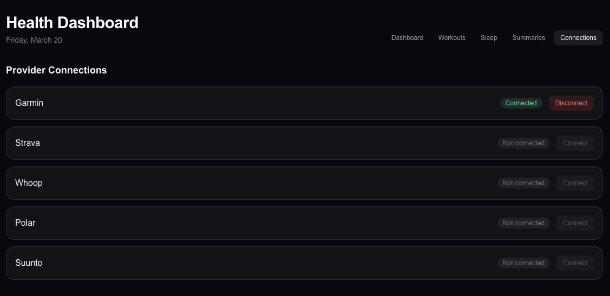

# wearables-demo

Demo app for exercising the real `@clipin/convex-wearables` Convex component.

The `@clipin/convex-wearables` component is open source: [clipinfit/convex-wearables](https://github.com/clipinfit/convex-wearables)

The demo mounts Garmin webhook and OAuth callback routes via `registerRoutes(...)` from the package, so the host app does not duplicate Garmin HTTP handler logic locally.

## Screenshots

### Health dashboard



### Integrations



## Environment variables

This demo uses the real `@clipin/convex-wearables` package and the Garmin routes it exposes, so you need the same core variables that the component setup expects.

At minimum, make sure these values are configured before running the demo:

```bash
# Created or updated by `npx convex dev`
NEXT_PUBLIC_CONVEX_URL=https://<your-deployment>.convex.cloud

# Garmin credentials used by the component client and mounted HTTP routes
GARMIN_CLIENT_ID=...
GARMIN_CLIENT_SECRET=...

# Used to build the Garmin OAuth callback URL inside Convex
CONVEX_SITE_URL=https://<your-deployment>.convex.site

# Recommended for correct post-auth redirects
# Local development falls back to http://localhost:3000 if omitted
NEXT_PUBLIC_APP_URL=http://localhost:3000
```

`NEXT_PUBLIC_CONVEX_URL` belongs in `.env.local`. The Garmin credentials and `CONVEX_SITE_URL` must also be available to the Convex runtime used by this demo.

For the full component setup, provider configuration, and webhook route details, read the upstream docs:

- [clipinfit/convex-wearables README](https://github.com/clipinfit/convex-wearables#readme)
- [Quick Start](https://github.com/clipinfit/convex-wearables#quick-start)
- [Webhook Support](https://github.com/clipinfit/convex-wearables#webhook-support)

## Local development

Start the Next.js app:

```bash
npm run dev
```

In a separate terminal, start Convex:

```bash
npx convex dev
```

The Convex dashboard shows logs for the dev deployment, but it does not pull code changes by itself. The local `npx convex dev` process is what uploads function changes.

## Updating `@clipin/convex-wearables`

This app uses the real `@clipin/convex-wearables` package from npm rather than a local file dependency.

When you want to test a newer component version:

1. Update the package version in `package.json`.

2. Reinstall dependencies:

```bash
npm install
```

3. Restart or rerun Convex so the updated component code is uploaded and codegen is refreshed:

```bash
npx convex dev
```

If `convex dev` is already running, stop it and start it again after updating the package.

## Sanity check

If the demo app is still calling old component code, inspect the generated component bindings:

```bash
rg "garminWebhooks|processPushPayload" convex/_generated/api.d.ts
```

If a new component module or function is missing there, the demo app has not picked up the installed component version yet.

An error like `Couldn't resolve wearables.garminWebhooks.processPushPayload` usually means this generated file is still stale.

One more constraint: the host app can only call component functions that are exposed as public `query`, `mutation`, or `action`. Component `internalQuery`, `internalMutation`, and `internalAction` functions are not callable through `components.wearables.*`.
